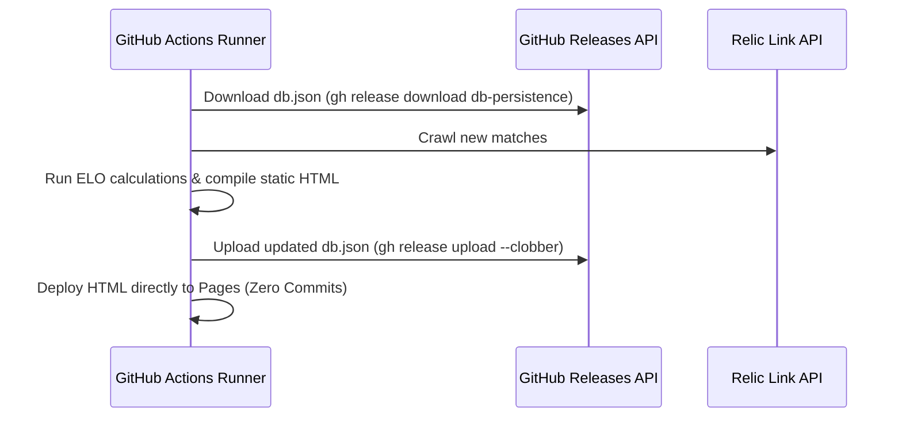

# Database Persistence & Zero-Commit Deployment Migration Plan

This document outlines the architectural plan to solve the **Git repository bloat** and **client-side loading performance** issues. It serves as a step-by-step guide to transition the database out of Git tracking, persist it using serverless caching, and deploy pre-rendered HTML pages directly to GitHub Pages.

---

## 1. Core Architectural Objectives

1.  **Zero Git Bloat**: Remove `docs/data/db.json` from the repository tracking. The `.git` folder will only track source code changes.
2.  **Instant Load Speeds**: Compile ELO calculations and HTML rendering on the server (GitHub Actions). The client will download a lightweight, pre-rendered static `index.html` (under ~40KB gzipped).
3.  **Zero-Commit Updates**: The cron crawler will compile the HTML and deploy it directly to GitHub Pages using official GitHub Actions deployment modules. **No auto-generated commits will be pushed back to the `main` branch.**

---

## 2. Persistent Database Storage Options

Since `db.json` will be gitignored, the GitHub Actions runner needs to load the database at the start of a run, update it, and save it back for the next execution.

### Option A: GitHub Release Assets (Recommended)
This approach stores the database as an asset attachment on a dedicated GitHub Release (e.g. tag `db-persistence`). It is 100% persistent and does not suffer from expiration.



#### GitHub Actions Workflow Integration (Releases):
```yaml
      - name: Download Database from Release
        env:
          GH_TOKEN: ${{ secrets.GITHUB_TOKEN }}
        run: |
          # Download db.json from the persistence release tag
          gh release download db-persistence --pattern 'db.json' --dir data/ || echo "No DB found. Starting fresh."

      - name: Run Crawler
        run: pnpm run crawl

      - name: Calculate ELO & Compile Site
        run: pnpm run elo

      - name: Upload Database to Release
        env:
          GH_TOKEN: ${{ secrets.GITHUB_TOKEN }}
        run: |
          # Upload and overwrite (clobber) the db.json file in the release
          gh release upload db-persistence data/db.json --clobber
```

---

### Option B: GitHub Actions Cache
This approach uses GitHub’s caching system. It is simpler to write but has a **7-day inactivity eviction policy**.

#### GitHub Actions Workflow Integration (Cache):
```yaml
      - name: Restore Database Cache
        id: db-cache
        uses: actions/cache/restore@v4
        with:
          path: data/db.json
          key: db-${{ github.run_id }}
          restore-keys: |
            db-

      - name: Run Crawler & Update DB
        run: pnpm run crawl

      - name: Save Updated Database to Cache
        uses: actions/cache/save@v4
        with:
          path: data/db.json
          key: db-${{ github.run_id }}
```

---

## 3. Transitioning to JSONL (JSON Lines) Format

To make the database structure stream-friendly and git-diff-friendly (if ever tracked locally), the single JSON database can be converted to separate JSONL files:

*   `data/matches.jsonl`: Append-only chronological list of match records.
*   `data/profiles.jsonl`: Event-sourced player profiles list.

### Reading JSONL Streams in Node.js
Instead of `JSON.parse(fs.readFileSync())`, which consumes high memory, parse the file line-by-line using standard Node streams:

```typescript
import * as fs from 'node:fs';
import * as readline from 'node:readline';

async function loadMatches(filePath: string): Promise<any[]> {
  const matches: any[] = [];
  if (!fs.existsSync(filePath)) return matches;

  const fileStream = fs.createReadStream(filePath);
  const rl = readline.createInterface({
    input: fileStream,
    crlfDelay: Infinity
  });

  for await (const line of rl) {
    if (line.trim()) {
      matches.push(JSON.parse(line));
    }
  }
  return matches;
}
```

### Appending to JSONL
Appending new matches is highly performant and doesn't require rewriting the file:

```typescript
import * as fs from 'node:fs';

function appendMatch(filePath: string, match: any) {
  const line = JSON.stringify(match) + '\n';
  fs.appendFileSync(filePath, line, 'utf-8');
}
```

---

## 4. No-Commit Static Site Generation (SSG) Deployment

GitHub Pages allows direct artifact deployments, skipping Git pushes entirely.

### Step 1: Configure Repository Settings
1.  Go to your repository on GitHub.
2.  Navigate to **Settings ➔ Pages**.
3.  Under **Build and deployment ➔ Source**, select **GitHub Actions** (instead of Deploy from a branch).

### Step 2: Configure the GitHub Actions YAML
Update `.github/workflows/relic-crawl.yml` to include Pages permissions and deployment steps:

```yaml
name: Relic API Crawl & ELO Update

on:
  schedule:
    - cron: '0 */4 * * *'
  workflow_dispatch:

# Grant permissions required for GitHub Pages deployments
permissions:
  contents: write      # For release uploads
  pages: write         # For Pages deployment
  id-token: write      # Required for OIDC authentication on deployment

jobs:
  deploy:
    environment:
      name: github-pages
      url: ${{ steps.deployment.outputs.page_url }}
    runs-on: ubuntu-latest
    steps:
      - name: Checkout repository
        uses: actions/checkout@v4

      # ... Setup Node, Restore DB, Run Scrapers ...

      - name: Build Static Site
        run: |
          # This compiles ELO ratings and writes static docs/index.html
          pnpm run compile-html  

      - name: Upload Pages Artifact
        uses: actions/upload-pages-artifact@v3
        with:
          # Target directory containing the compiled static index.html and style.css
          path: docs/

      - name: Deploy to GitHub Pages
        id: deployment
        uses: actions/deploy-pages@v4
```

---

## 5. Migration Execution Steps (When Ready to Pick Up)

1.  **Configure Gitignore**:
    Add `data/db.json` (or `data/db.jsonl`) to `.gitignore` and run `git rm --cached docs/data/db.json` to untrack it.
2.  **Create GitHub Persistence Tag**:
    If using Releases, create a dummy tag and release:
    ```bash
    git tag v1.0.0-database
    git push origin v1.0.0-database
    gh release create v1.0.0-database --notes "Internal database persistence release"
    ```
    Attach your current `db.json` as an initial asset:
    ```bash
    gh release upload v1.0.0-database docs/data/db.json
    ```
3.  **Refactor ELO Calculator to Render Static HTML**:
    Convert `src/cli.ts` or write a new compilation script (`src/compile.ts`) that reads the database, runs ELO loops, and formats the output into `docs/index.html`.
4.  **Adopt Deployment YAML**:
    Update `.github/workflows/relic-crawl.yml` with the configuration from Section 4. Change your GitHub Pages source settings to **GitHub Actions**.
