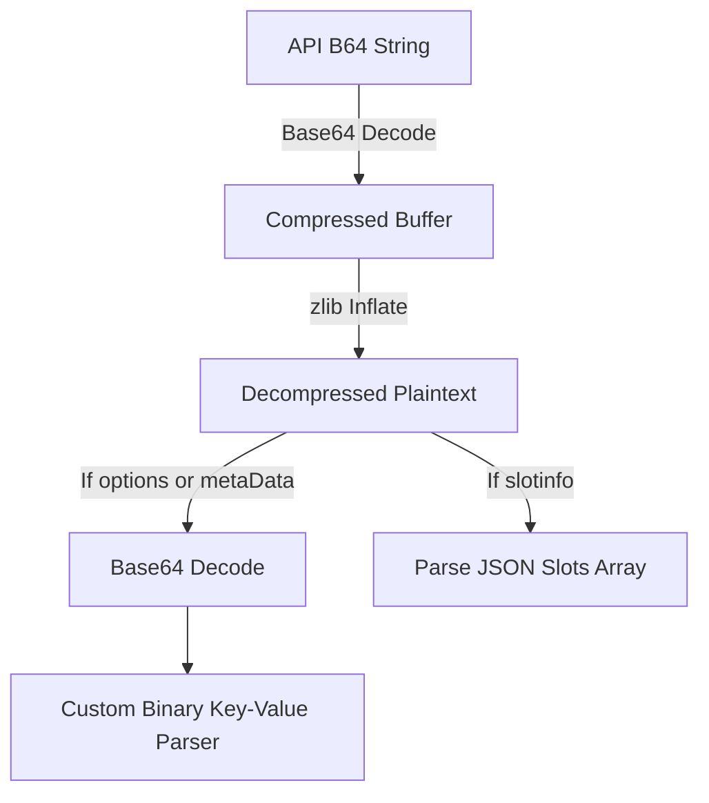

# Relic Link API: Match Options & SlotInfo Schema

This document details the reverse-engineered schema of the `options` and `slotinfo` payloads found in the match objects returned by the Relic Link API (for Age of Empires II DE).

---

## 1. Payload Encoding & Compression

Both `options` and `slotinfo` payloads are stored as doubly encoded strings:
1. **Outer Compression**: The raw field value is a **Base64-encoded, zlib-compressed string**.
2. **Decompression**: Inflating the buffer yields a plaintext ASCII string.
3. **Inner Decode**: The resulting string is either a JSON array or a secondary **Base64-encoded binary buffer** with a custom serialization format.



---

## 2. Custom Binary Key-Value Format

For both the `options` payload and the nested player `metaData` inside `slotinfo`, the inner decoded binary buffer uses a custom length-prefixed key-value format:

- **Byte 0**: `N` (1 byte, `Uint8`) – Total number of key-value pairs stored.
- **N Pairs follow**, where each pair consists of:
  - **Key**:
    - `Length` (4 bytes, `Int32LE`) – Size of the key string in bytes.
    - `Value` (ASCII/UTF-8 string) – The key identifier.
  - **Value**:
    - `Length` (4 bytes, `Int32LE`) – Size of the value string in bytes.
    - `Value` (ASCII/UTF-8 string) – The value setting.

> [!NOTE]
> In the global **`options`** payload, each key-value pair is stored as a single string of the form `"Key:Value"` inside a single element.
> In the player **`metaData`** payload, keys and values are separate elements (consecutive pairs of key-length/key-string followed by value-length/value-string).

---

## 3. Global Options Schema

The `options` payload contains global game lobby settings. The schema has evolved over time (specifically between older match IDs in the 30M–90M range from ~2020, and newer match IDs in the 400M+ range from ~2026).

### Match Settings Mapping

| Key | Gameplay Setting | Target Version | Values / Legend |
|---|---|---|---|
| **`0`** | Starting Age | New | `0`: Standard (Dark Age), `2`: Castle Age, `3`: Imperial Age, `6`: Post-Imperial |
| **`5`** | Starting Resources | New | `0`: Standard, `1`: Medium, `2`: High, `3`: Ultra |
| **`8`** | Map Size (Tile Dimension) | New | `120`: Tiny (2p), `144`: Small (3p), `168`: Medium (4p), `200`: Normal (6p), `220`: Large (8p), `240`: Giant (8p) |
| **`9`** | Reveal Map State | New | `0`: Normal, `1`: Explored, `2`: All Visible, `3`: Blind |
| **`11`** | Map ID / Custom RMS Filename | Old / Custom | In older matches: Standard Map ID (e.g. `9` for Arabia/Ghost Lake, `29` for Arena).<br>In newer custom matches: Custom `.rms` filename (e.g. `FOREST NOTHING DE.rms`). |
| **`16`** | Population Cap | Old | e.g. `250` |
| **`21`** | Game Speed | Old | `1`: Normal/Fast? |
| **`22`** | Game Speed | New | `0`: Casual, `1`: Normal, `2`: Fast (Ranked standard) |
| **`28`** | Population Cap | New | e.g. `200`, `250`, `300`, `400`, `500` |
| **`38`** | Custom Scenario Filename | New | `.aoe2scenario` filename (e.g. `CBA_=REQUIEM=_V292.aoe2scenario`) |
| **`57`** | Treaty Length | New | `0`: None, `5`/`15`/`20`/`40`: Duration in minutes |
| **`59`** | Published Mod ID | New | Official workshop mod published ID (e.g. `363188` for 10x Shared Civ) |
| **`61`** | Map Size Index | New | `0`: Tiny, `1`: Small, `2`: Medium, `3`: Normal, `4`: Large, `5`: Giant |
| **`63`** | Published Mod Name | New | Name of the active workshop mod (e.g. `[Hex] 10x Shared Civ (2.3)`) |
| **`77`** | Hidden Civs Toggle | New | `y`: Enabled (Ranked default), `n`: Disabled |
| **`79`** | Allow Cheats Toggle | New | `y`: Enabled, `n`: Disabled (Ranked default) |
| **`93`** | Match Type ID | New | Matches the API's `matchtype_id` (e.g. `6`: 1v1 RM, `7`: 2v2 RM, `8`: 3v3 RM, `9`: 4v4 RM, `0`: Custom) |

---

## 4. SlotInfo Schema

The `slotinfo` payload contains player lobby assignments, civilizations, teams, and ready statuses.

### Outer Format
Decompressing `slotinfo` yields a version prefix followed by a JSON array:
```
12,[{"profileInfo.id":15778259,"stationID":1,"teamID":0,...}]
```

### Player Slot Object Fields

| Field | Type | Description |
|---|---|---|
| `profileInfo.id` | `Number` | Player profile ID. |
| `stationID` | `Number` | Slot/station number (1-indexed). |
| `teamID` | `Number` | Team index (0-indexed: `0` for Team 1, `1` for Team 2, etc.). |
| `factionID` | `Number` | Faction (always `0`). |
| `raceID` | `Number` | Civilization ID. |
| `rankLevel` | `Number` | Leaderboard rank level. |
| `rankMatchTypeID` | `Number` | Leaderboard rank match type ID. |
| `timePerFrameMS` | `Number` | Latency/simulation speed indicator. |
| `isReady` | `Number` | Ready status (`0`: Not Ready, `1`: Ready). |
| `status` | `Number` | Slot status code. |
| `metaData` | `String` | Base64-encoded player metadata (wrapped in double quotes). |

---

## 5. Player MetaData Schema

Decoding the `metaData` string inside a player's slot yields custom settings selected by that player. It contains exactly **2 or 3 pairs** of length-prefixed strings.

### Player Settings Mapping

| Key | Gameplay Setting | Values / Legend |
|---|---|---|
| **`ScenarioPlayerIndex`** (or **`0`**) | Scenario Slot Index | `0`, `1`, `2`... (Matches player position in scenario files) |
| **`Team`** | Dropdown Team Selection | `1`: Random (`?`), `2`: Team 1, `3`: Team 2, `4`: Team 3, `5`: Team 4 |

---

## 6. Parsing Reference (JavaScript)

```javascript
import zlib from 'zlib';

/**
 * Parses options key-value pairs
 */
export function decodeOptions(optionsB64) {
  if (!optionsB64) return {};
  const compressed = Buffer.from(optionsB64, 'base64');
  const decompressedStr = zlib.inflateSync(compressed).toString('utf8');
  const binaryBuffer = Buffer.from(decompressedStr, 'base64');
  
  const pairCount = binaryBuffer.readUInt8(0);
  const options = {};
  let offset = 1;
  
  for (let i = 0; i < pairCount; i++) {
    if (offset + 4 > binaryBuffer.length) break;
    const len = binaryBuffer.readInt32LE(offset);
    offset += 4;
    if (offset + len > binaryBuffer.length) break;
    const kvStr = binaryBuffer.toString('utf8', offset, offset + len);
    offset += len;
    
    const colonIndex = kvStr.indexOf(':');
    if (colonIndex !== -1) {
      options[kvStr.slice(0, colonIndex)] = kvStr.slice(colonIndex + 1);
    }
  }
  return options;
}

/**
 * Parses slotinfo slots JSON and nested player metadata
 */
export function decodeSlotInfo(slotInfoB64) {
  if (!slotInfoB64) return null;
  const compressed = Buffer.from(slotInfoB64, 'base64');
  const decompressedStr = zlib.inflateSync(compressed).toString('utf8');
  
  const commaIdx = decompressedStr.indexOf(',');
  if (commaIdx === -1) return null;
  
  const version = decompressedStr.slice(0, commaIdx);
  const jsonStr = decompressedStr.slice(commaIdx + 1);
  const cleanJsonStr = jsonStr.replace(/\0+$/, '').trim(); // Remove trailing nulls
  
  const slots = JSON.parse(cleanJsonStr);
  return {
    version: parseInt(version, 10),
    slots: slots.map(slot => ({
      ...slot,
      metaDataDecoded: decodePlayerMeta(slot.metaData)
    }))
  };
}

function decodePlayerMeta(metaB64) {
  if (!metaB64) return {};
  let rawStr = Buffer.from(metaB64, 'base64').toString('utf8');
  if (rawStr.startsWith('"') && rawStr.endsWith('"')) {
    rawStr = rawStr.slice(1, -1);
  }
  const buf = Buffer.from(rawStr, 'base64');
  if (buf.length === 0) return {};
  
  const pairCount = buf.readUInt8(0);
  const meta = {};
  let offset = 1;
  
  for (let i = 0; i < pairCount; i++) {
    if (offset + 4 > buf.length) break;
    const keyLen = buf.readInt32LE(offset);
    offset += 4;
    const key = buf.toString('utf8', offset, offset + keyLen);
    offset += keyLen;
    
    if (offset + 4 > buf.length) break;
    const valLen = buf.readInt32LE(offset);
    offset += 4;
    const val = buf.toString('utf8', offset, offset + valLen);
    offset += valLen;
    
    meta[key] = val;
  }
  return meta;
}
```
